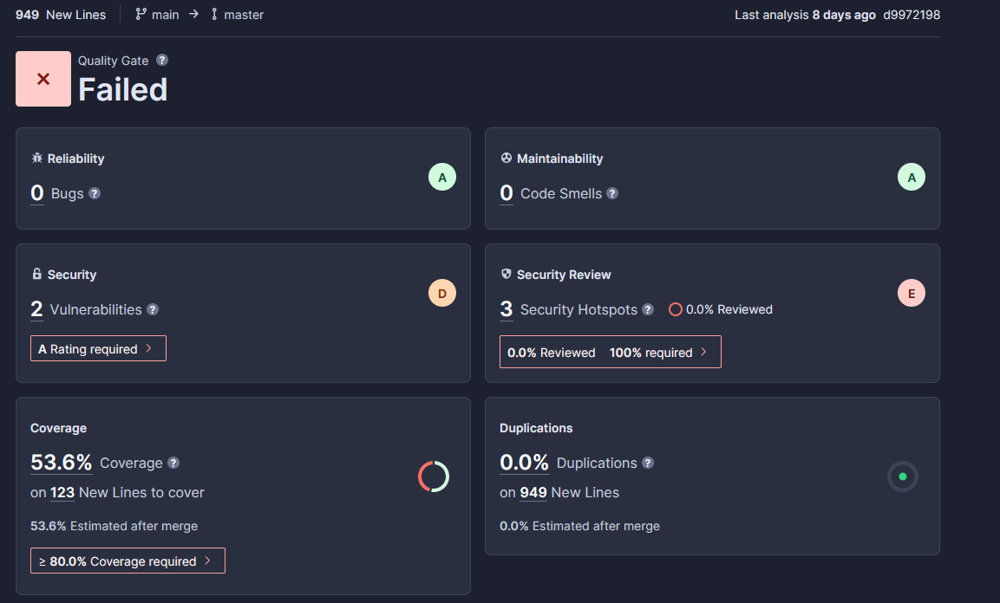

## TP-1: Docker
### Docker
#### DockerFile
```DockerFile
FROM postgres:14.1-alpine
ENV POSTGRES_DB=db 
   POSTGRES_USER=usr
   POSTGRES_PASSWORD=pwd
COPY 01-CreateScheme.sql /docker-entrypoint-initdb.d/
COPY 02-InsertData.sql /docker-entrypoint-initdb.d/
```

Dans cette partie, nous initialisons notre container de notre base de données. En effet, avec la première commande nous indiquons à Docker l'image nécessaire à notre container.
Les lignes reliées à *ENV* permettent de paramétrer notre base de données. Nous définissons donc le nom, le nom d'utilisateur et le mot de passe de celle-ci.
*Copy* permet de mettre nos fichiers SQL dans notre container lors de sa construction.
#### Commande
Voici les commandes saisies pour lancer nos containers:
```Command
1- docker network create app-network

2- docker build -t mdum78/databasecontainer .

3- docker run -p "5432:5432" --net=app-network --name=database -d mdum78/databasecontainer

4- docker run -p "8090:8080" --net=app-network --name=adminer -d adminer
```
- 1: Nous créons tout d'abord un réseau local
- 2: nous construisons notre image à partir du Docker file précédent
- 3: Nous lançons notre container sur le réseau créé
- 4: nous lançons un administrateur de base de données sur le même réseau 
### Back-API
Cela permet de réduire l'image et d'optimiser les couches de notre images. Dans notre cas, nous construisons notre image avec *Maeven* puis nos préparons celle la en copiant les fichier nécessaire.

```dockerfile
#Build
#Construction de l'image maeven
FROM maven:3.8.6-amazoncorretto-17 AS myapp-build
#Définition d'une variable d'environnement lié au dossier
ENV MYAPP_HOME /opt/myapp
#définit le dossier de travail
WORKDIR $MYAPP_HOME
#copie le fichier pom
COPY pom.xml .
#copie le dossier src
COPY src ./src
#lance la construction du projet Maeven
RUN mvn package -DskipTests

FROM amazoncorretto:17
#Définition d'un variable d'environnement
ENV MYAPP_HOME /opt/myapp
#Définition du dossier de travail
WORKDIR $MYAPP_HOME
#copie les fichier jar de target dans la dossier de travail
COPY --from=myapp-build $MYAPP_HOME/target/*.jar $MYAPP_HOME/myapp.jar
#lancement du programme une fois l'image lancée
ENTRYPOINT java -jar myapp.jar
```

### Link Application
Le fichier *docker-compose.yml* est un fichier permettant de centraliser les dockerfiles et d'avoir une version plus lisible de nos containers/images.

Nous définition pour cela une liste de *services* qui contiendra tous nos containers. Dans chacun de nos containers (*backend*, *httpd* etc...), vont être défini à l'aide de mot clés:
- *build*: permet de construire notre image
- *network:* permet de connecter notre containers aux réseaux voulu
- *depends-on:* définit les dépendances existantes de notre containers

## TP-2: Github-Action

*Lien pour le TP2:* https://github.com/Kooitfeet/devops-livecoding

Les testcontainers est une bibliothèques *Java* permettant de gérer les différents containers dans nos tests. Dans notre exemple, ce sont pour tester la base de données et les autres services.
```yaml
name: CI devops 2023
on:
  push:
    branches:
      - main
  pull_request:
jobs:
  test-backend: #nom du test
    runs-on: ubuntu-22.04 #test réalisé sur ubunto
    steps: #étapes à réaliser
      - uses: actions/checkout@v2.5.0 #copie le github dans l'environnement test
      - name: Set up JDK 17 #définition du nom de l'étape
        use: actions/setup-java@v2 #précise la version de Java
        with:
          java-version: 17
      - name: Build and test with Maven #définition du nom de l'étape
        run: mvn clear verify #lance la commande pour le test
```


Nous voyons que nous avons 2 vulnérabilités de sécurité (dans l'onglet *security*) ainsi qu'un scanne de dossier de seulement 53.6% (dans l'onglet *Coverage*).
*SonarCloud* conclut que l'analyse n'est pas bonne car il faut un pourcentage supérieur à 80%.

## TP-3: Ansible
Dans notre inventorie, nous avons un fichier setup permettant de configurer ansible.
##### setup.yml:
```yaml
all:
 vars:
   ansible_user: centos
   ansible_ssh_private_key_file: /etc/ansible/id_rsa2
 children:
   prod:
     hosts: maxence.dumontier.takima.cloud
```
Ce fichier indique à ansible l'adresse du serveur (*hosts*), l'utilisateur (*ansible_user*) et la clé permettant d'y accéder (*ansible_ssh_private_key_file*).

La commande suivante permet alors de configurer l'ensemble des serveurs à l'aide du fichier ci-dessus:
```command
ansible all -i inventories/setup.yml -m setup -a "filter=ansible_distribution*"
```

Pour qu'Ansible puisse commencer les configurations, nous avons besoin de créer un *playbook* qui lancera par la suite nos *rôles*, lançant ainsi les configuration et les services sur notre serveur.
###### playbook.yml
```yaml
- hosts: all
  gather_facts: false
  become: true
  roles:
    - docker
    - network
    - database
    - app
    - proxy
```
Nous voyons ci-dessus qui tous les serveurs sont concernés (*hosts: all*) et que nous exécutons cela en tant que super-utilisateur (*become: true*).
Nous avons ensuite la liste des rôles à exécuter par ansible (*rôle: -docker...*).

###### docker/tasks/main.yml
```yaml
- name: Install device-mapper-persistent-data
  yum:
    name: device-mapper-persistent-data
    state: latest
  
- name: Install lvm2
  yum:
    name: lvm2
    state: latest
  
- name: add repo docker
  command:
    cmd: sudo yum-config-manager --add-repo=https://download.docker.com/linux/centos/docker-ce.repo

- name: Install Docker
  yum:
    name: docker-ce
    state: present
  
- name: Install python3
  yum:
    name: python3
    state: present
  
- name: Install docker with Python 3
  pip:
    name: docker
    executable: pip3
  vars:
    ansible_python_interpreter: /usr/bin/python3

- name: Make sure Docker is running
  service: name=docker state=started
  tags: docker
```

Le docker_container tasks permet la configuration des containers docker au sein de notre serveur. Pour cela plusieurs installation sont nécessaire comme docker (*Install Docker*), python (*Install python3*) ou bien lvm2 (*Install lvm2*). Nous ajoutons également un dossier pour notre projet (*add repo docker*) et nous terminons le rôles en vérifiant que tout est lancé (*Make sure Docker is running*).
